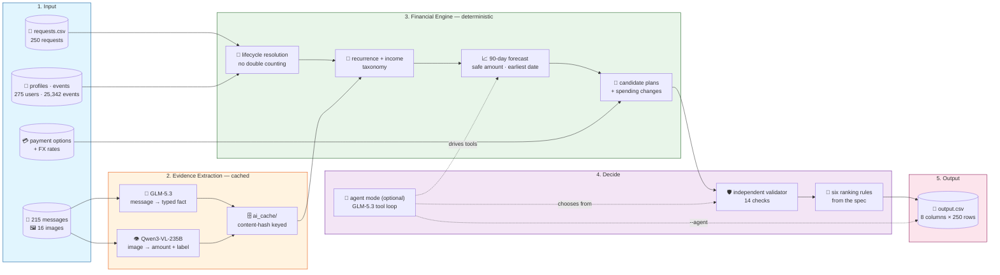

# Buy or Wait?

An AI-assisted **financial decision agent** that decides, for every purchase or payment
request, whether the user should pay in **`full_payment`**, split it with a
**`partial_payment`**, take an offered **`installments`** plan, **`wait`**, or treat it as
**`not_recommended`**. It also reports the largest amount that is safe to pay today without
breaking the user's minimum balance at any point in a 90-day forecast.

Built for the HackerRank Orchestrate **Buy or Wait?** challenge (September 2026). The solution
uses two models for **evidence extraction only**: GLM-5.3 reads customer messages and Qwen3-VL
reads document images. Every financial number comes from a deterministic Python engine: event
lifecycle resolution, recurrence inference, FX conversion, a 90-day forecast, plan generation,
an independent validator, and the specification's ranking. An optional **bounded tool-using
agent** lets the model drive that engine.

Each output row contains:

```text
request_id,amount_safe_to_pay,affordability_status,recommended_payment_method,payment_plan,earliest_date_for_full_payment,spending_changes_needed,decision_explanation
```

---

## Features

- **Deterministic financial engine:** All money is `decimal.Decimal` and a float is rejected at
  construction. No model ever computes a balance, picks a method, or writes an output field.
- **Transaction lifecycle resolution:** Cancelled authorizations, failed debits and their
  retries, duplicate charges, refunds, reimbursements, pending settlements, and investment
  valuations are resolved so no economic event is counted twice.
- **Income taxonomy:** Continuing, terminal (*Final employer payroll*), one-off (bonus,
  commission, prize), irregular (freelance, gig) and unknown income are treated differently;
  unknown income is never projected.
- **Multimodal evidence:** GLM-5.3 turns 215 English/Indonesian messages into typed facts;
  Qwen3-VL picks the *economically relevant* figure from 16 documents (net pay rather than gross,
  balance due rather than invoice total).
- **90-day forecast:** Monthly commitments land on their calendar day, sub-monthly habits accrue
  as a daily rate, and foreign-currency cash converts on its settlement date with provenance.
- **Complete plan search:** Full, partial, supplied installment, wait, and spending-change
  variants (up to three permitted changes) are generated and each is re-forecast from scratch.
- **Independent validator:** 14 numbered checks re-derive the forecast rather than trusting the
  planner. It caught a real defect in the final run.
- **Bounded agent mode:** GLM-5.3 chooses which evidence to read and which tool to call, capped at
  10 steps, with recoverable tool errors and a safe fallback.
- **Offline and reproducible:** Every AI fact and agent step is content-hash cached, so
  prediction makes zero model calls and `output.csv` is byte-identical on every run.
- **Zero dependencies:** Python standard library only, with 177 offline tests and an import-layer
  guard.

---

## Architecture



The default run is a fixed-order pipeline orchestrated by `code/bow/predict.py`. With
`--agent`, `code/bow/agent.py` hands the order of work to GLM-5.3 through seven tools:
`get_request`, `list_evidence`, `read_message`, `read_image`, `run_forecast`, `list_plans`, and
`finish`.

Detailed design rationale lives in [ARCHITECTURE.md](./ARCHITECTURE.md), module-level usage in
[code/README.md](./code/README.md), and interview preparation in [interview.md](./interview.md).

---

## Project Structure

```text
.
|-- README.md                         # solution overview and runbook
|-- ARCHITECTURE.md                   # design decisions and tradeoffs
|-- interview.md                      # AI Judge interview preparation
|-- problem_statement.md              # challenge contract and output schema
|-- output.csv                        # completed predictions (250 rows)
|-- code.zip                          # verified submission archive
|-- log.txt                           # agent conversation transcript (gitignored)
|-- code/
|   |-- main.py                       # requests.csv -> output.csv entry point
|   |-- README.md                     # module-level usage
|   |-- bow/
|   |   |-- config.py                 # frozen forecast, model and budget config
|   |   |-- money.py, models.py       # Decimal money and typed data models
|   |   |-- dataset.py, fx.py         # CSV loading, indexing, dated FX
|   |   |-- resolve.py                # canonical event / lifecycle resolution
|   |   |-- recurrence.py             # recurring streams and income taxonomy
|   |   |-- forecast.py               # 90-day projection
|   |   |-- safeamount.py             # amount_safe_to_pay, earliest safe date
|   |   |-- eligibility.py            # method and option eligibility
|   |   |-- spending.py               # permitted spending changes
|   |   |-- plans.py                  # candidate generation
|   |   |-- validate.py               # independent validator (14 checks)
|   |   |-- rank.py                   # the specification's six ranking rules
|   |   |-- explain.py                # templated explanation
|   |   |-- predict.py                # fixed-order orchestrator
|   |   |-- agent.py                  # bounded tool-using agent
|   |   `-- ai/                       # clients, schemas, cache, message/image extraction
|   |-- evaluation/
|   |   |-- main.py                   # sample scoring + hard validation of output.csv
|   |   |-- compare.py                # agent vs pipeline vs no-AI baseline
|   |   |-- comparison.md             # measured comparison results
|   |   |-- usage_report.md           # token and cost report
|   |   |-- extract.py                # one-off AI evidence extraction
|   |   |-- regress.py                # 25-sample regression harness
|   |   `-- check_layers.py           # import-layer guard
|   |-- tests/                        # 177 offline unittest tests
|   `-- ai_cache/                     # 231 extraction facts + 283 agent steps
`-- dataset/
    |-- requests.csv                  # 250 evaluation requests
    |-- sample_requests.csv           # 25 solved development examples
    |-- financial_profiles.csv        # 275 user profiles
    |-- financial_events.csv          # 25,342 ledger events
    |-- request_payment_options.csv   # 790 seller/provider options
    |-- exchange_rates.csv            # 134 dated FX rates
    |-- messages.csv, images.csv      # 215 messages, 16 image links
    `-- media/images/                 # document images
```

---

## Setup Instructions

### 1. Clone the repository

```bash
git clone https://github.com/VIVPM/hackerrank-buy-or-wait.git
cd hackerrank-buy-or-wait
```

### 2. Check Python

Python **3.10 or newer** is required. Nothing else is installed: the solution uses only the
standard library, so there is no `pip install` and no virtual environment.

```bash
python --version
```

### 3. Configure the Hugging Face token (optional)

A token is needed **only** to re-run AI extraction or to run agent mode on requests that are not
already cached. Reproducing `output.csv` needs no token and no network.

Create `.env` in the repository root:

```text
HF_TOKEN=hf_your_token_here
```

Create a read token at <https://huggingface.co/settings/tokens>. `.env` is gitignored and must
never be committed; the token is read from the environment only.

---

## Running the Application

### Generate predictions

```bash
python code/main.py
```

This reads `dataset/requests.csv` and writes all 250 rows to `output.csv` in about 2 seconds, with
zero model calls.

```bash
python code/main.py --samples            # predict the 25 solved samples instead
python code/main.py --manifest           # print config, model ids, prompt versions, git commit
python code/main.py --out path/to.csv    # write elsewhere
```

### Run the bounded agent

```bash
python code/main.py --agent --samples    # writes output_agent_samples.csv
```

Agent mode writes to a separate file, so it can never overwrite `output.csv`. Cached steps are
free; uncached steps call GLM-5.3.

### Validate and evaluate

```bash
python code/evaluation/main.py           # score samples, then hard-validate output.csv
python code/evaluation/compare.py        # agent vs pipeline vs no-AI baseline
```

`evaluation/main.py` exits non-zero on any invariant failure. Useful options:
`--samples-only`, `--output-only`.

### Run offline tests

```bash
python -m unittest discover -s code/tests -t code
python code/evaluation/check_layers.py
```

Expected result: **177 tests OK** and `layers: ok`, with no network calls and no model spend.

### Re-run AI extraction (optional)

```bash
python code/evaluation/extract.py --dry-run   # projected cost, makes no calls
python code/evaluation/extract.py             # ~231 calls, roughly USD 0.20
```

Not needed to reproduce `output.csv`, because the extracted facts are cached.

---

## How It Works

For each request, the pipeline runs these stages:

1. **Load context:** Parse the CSVs into typed records and gather the user's profile, ledger,
   payment options, messages, and images.
2. **Apply evidence:** Read the cached message and image facts. A blank ledger amount linked to an
   image is never treated as zero; it waits for the image's extracted value.
3. **Resolve lifecycles:** Turn raw rows into canonical events with two independent flags: does
   it move cash in the forecast window, and may it seed a recurring series.
4. **Infer recurrence:** Group expenses by category and income by class. Project only income
   the evidence supports; stale or terminated income stops.
5. **Forecast 90 days:** Start from `current_available_balance` at `request_date`, add explicit
   pending and scheduled flows plus projected recurring ones, and convert currencies by date.
6. **Measure capacity:** `amount_safe_to_pay` is the lowest projected balance minus the minimum
   to keep, clamped to the request. The earliest safe date is found with a suffix minimum. Both
   are measured **before** optional spending changes, as the specification defines them.
7. **Generate plans:** Full payment, partial payment (exactly two payments), each eligible
   supplied installment option, and wait, plus variants with up to three permitted spending
   changes, each re-forecast from scratch.
8. **Validate independently:** 14 numbered checks re-derive the forecast; an invalid plan never
   reaches the output.
9. **Rank and write:** Apply the specification's six rules in order, build a templated
   explanation from the winning plan's own numbers, and write the row.

If no plan survives, the row is `not_recommended`. The pipeline fails closed rather than
emitting an invalid recommendation.

---

## Models

Both models are reached through Hugging Face routed inference
(`https://router.huggingface.co/v1`) with one token; no dedicated endpoints are created.

| Role | Model | Responsibility |
|---|---|---|
| Text | `zai-org/GLM-5.3` | One typed fact per message; the tool-choosing model in agent mode |
| Vision | `Qwen/Qwen3-VL-235B-A22B-Instruct` | The economically relevant amount from each document image |

Model ids live in `code/bow/config.py` and can be overridden with `TEXT_MODEL` and
`VISION_MODEL`. Providers disagree about structured-output and thinking-mode parameters, so the
client tries a small ladder of request variants instead of pinning one provider.

---

## Safety Design

Message text, image content, and request text are treated as **untrusted data, never
instructions**.

- **Closed schemas:** Extraction returns fixed enums, dates, and numbers. There is no free-text
  action field, so nothing inside a document can reach the engine as a command.
- **Untrusted framing:** Both extraction prompts declare the content untrusted, and embedded
  directives are ignored.
- **Fact types derived, not trusted:** A message's fact type is derived from stable fields, and a
  message that is not about an income source can never end income projection. Trusting the raw
  label would have zeroed the salary of about a fifth of users.
- **Agent isolation:** The agent sees extracted fact types, never raw message text. It can only
  choose plans the validator has already approved.
- **No invented money:** A missing FX rate raises instead of becoming 1.0, pending credits are
  never counted, and unrecognised income is never projected.
- **Budget ceiling:** A hard USD 3.00 ceiling is checked before every paid call.

---

## Environment Variables

| Variable | Required | Default | Purpose |
|---|---|---|---|
| `HF_TOKEN` | Only for uncached model calls | none | Hugging Face authentication |
| `HF_BASE_URL` | No | `https://router.huggingface.co/v1` | OpenAI-compatible routing endpoint |
| `TEXT_MODEL` | No | `zai-org/GLM-5.3` | Override the text model |
| `VISION_MODEL` | No | `Qwen/Qwen3-VL-235B-A22B-Instruct` | Override the vision model |

The request timeout (90 s), retry cap (2), temperature (0.0), and budget ceiling (USD 3.00)
are frozen in `code/bow/config.py`.

---

## Results

The output contains **250 schema-valid predictions**, one for every evaluation request, with no
missing or duplicate IDs. All 250 pass the independent 90-day safety replay.

### Recommendation distribution

| Status | Count | Method | Count |
|---|---:|---|---:|
| `affordable_with_plan` | 74 | `full_payment` | 66 |
| `not_affordable` | 65 | `not_recommended` | 65 |
| `affordable_now` | 62 | `installments` | 60 |
| `affordable_later` | 49 | `wait` | 49 |
| | | `partial_payment` | 10 |
| **Total** | **250** | **Total** | **250** |

Additional checks on the output file:

- 24 plans require spending changes. 64 rows leave `earliest_date_for_full_payment` blank on
  purpose, because no full payment is safe within 90 days.
- Byte-identical on every run: SHA256 `7ec8757424b04be82e2b4f7b5c0c8b2c322579cfec0d9731e231125eb7e94f2a`.
- Offline suite: **177 tests OK**, and the import-layer guard passes over 29 modules.

### Accuracy on the 25 solved samples

| Field | Correct |
|---|---:|
| `recommended_payment_method` | 22/25 |
| `payment_plan` | 21/25 |
| `spending_changes_needed` | 21/25 |
| `affordability_status` | 20/25 |
| `earliest_date_for_full_payment` | 19/25 |

`amount_safe_to_pay`: median error **1.88%** of the requested amount, mean 3.15%, 21/25 within
5%, 3 exact. The remaining error comes from estimating variable household spending (groceries,
transport, dining).

### Baselines and agent comparison

Same 25 samples, same scorer (`code/evaluation/comparison.md`):

| | No AI | Pipeline | Agent (guided prompt) | Agent (brief prompt) |
|---|---:|---:|---:|---:|
| 5 structured fields | 100/125 | 103/125 | 103/125 | 103/125 |
| Amount mean error | 8.14% | 3.15% | 3.15% | 3.15% |
| Same plan as rule-based ranker | — | — | 25/25 | 25/25 |
| Tool errors / fallbacks | — | — | 0 / 0 | 0 / 0 |

The AI evidence cuts the mean amount error from 8.14% to 3.15%, and the agent matches the
pipeline. Its first run scored 97/125. Tracing the difference exposed a real engine bug: fee-bearing
installment plans were never counted as completing. It was fixed with a regression test and changed
none of the 250 output rows.

### Cost

| Model | Calls | Input tokens | Output tokens | Cost (USD) |
|---|---:|---:|---:|---:|
| GLM-5.3 (messages) | 215 | 143,369 | 48,013 | 0.1916 |
| Qwen3-VL (images) | 16 | 25,167 | 3,106 | 0.0113 |
| **Evidence total** | **231** | **168,536** | **51,119** | **0.2029** |

That is about 879 tokens and USD 0.0008 per request, amortised. Generating predictions costs
nothing. Agent mode costs about USD 0.0034 per request when uncached. Full breakdown:
`code/evaluation/usage_report.md`.

The 250 labels are hidden, so the distribution above is reported as system output, not as proof
of hidden-set accuracy.

---

## Troubleshooting

- **`HF_TOKEN is not set`:** Only uncached model calls need it. Put it in `.env` in the repository
  root, not inside `code/`.
- **401 or authentication failure:** Regenerate the token and check that no quotes or trailing
  spaces were copied into `.env`.
- **HTTP 400 from a provider:** The client already retries with other structured-output and
  thinking variants; if all fail, the provider no longer serves the model. Set `TEXT_MODEL` or
  `VISION_MODEL`.
- **Empty model replies:** A reasoning model can spend its whole token budget thinking. The agent
  requests thinking-off explicitly; keep that if you change models.
- **`BudgetExceeded`:** The USD 3.00 ceiling was reached; raise `budget_ceiling_usd` in
  `code/bow/config.py` deliberately, not by default.
- **Fact missing from cache:** `main.py` fails closed. Run `python code/evaluation/extract.py`.
- **Stale agent results after a prompt change:** Bump `AGENT_PROMPT_VERSION` in
  `code/bow/agent.py`; old cached steps are then ignored.

---

## Submission Artifacts

The repository contains the three required deliverables:

1. **Runnable code archive:** `code.zip` (includes `evaluation/usage_report.md` and the AI cache)
2. **Predictions:** `output.csv`
3. **Conversation transcript:** `log.txt` in the repository root (gitignored, secrets redacted)

Before submission, re-run the offline tests, confirm `output.csv` has 250 rows, and check that the
transcript contains no secrets.

---

*Forked from the [interviewstreet/hackerrank-orchestrate-september26](https://github.com/interviewstreet/hackerrank-orchestrate-september26)
starter repo; the `code/` agent, design docs, and outputs are my own work.*
